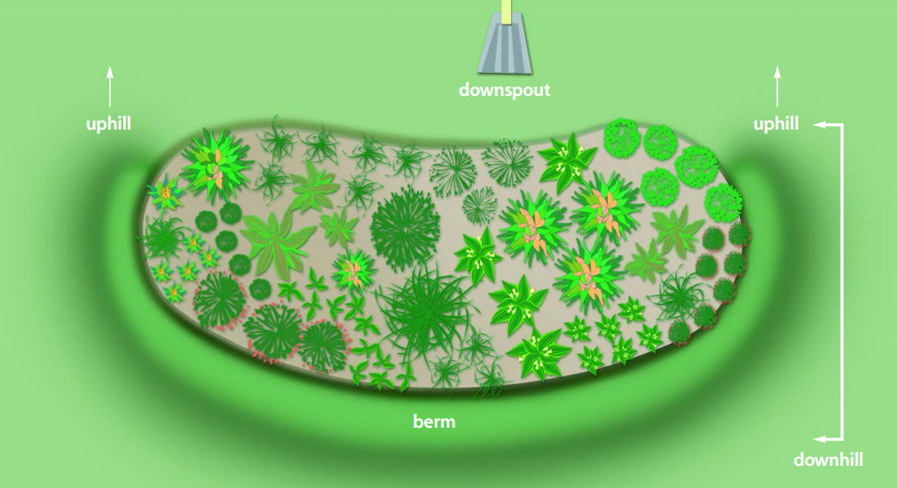
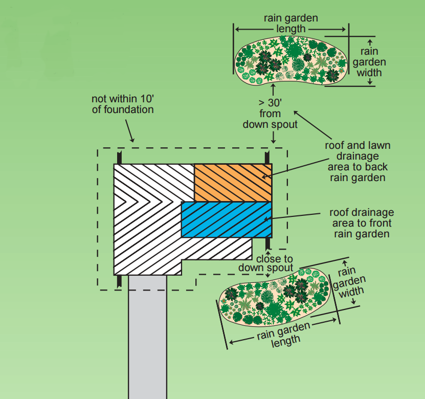
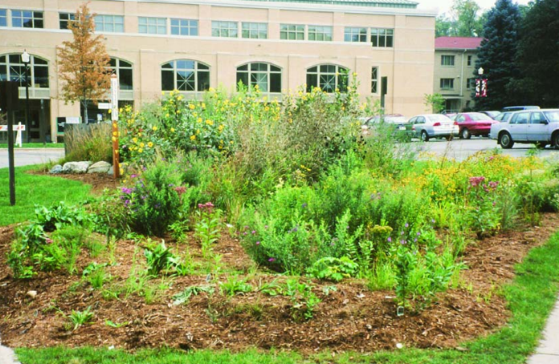
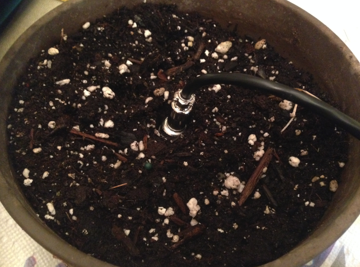
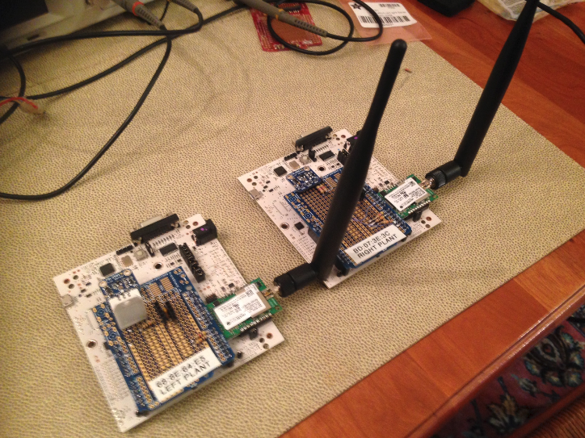
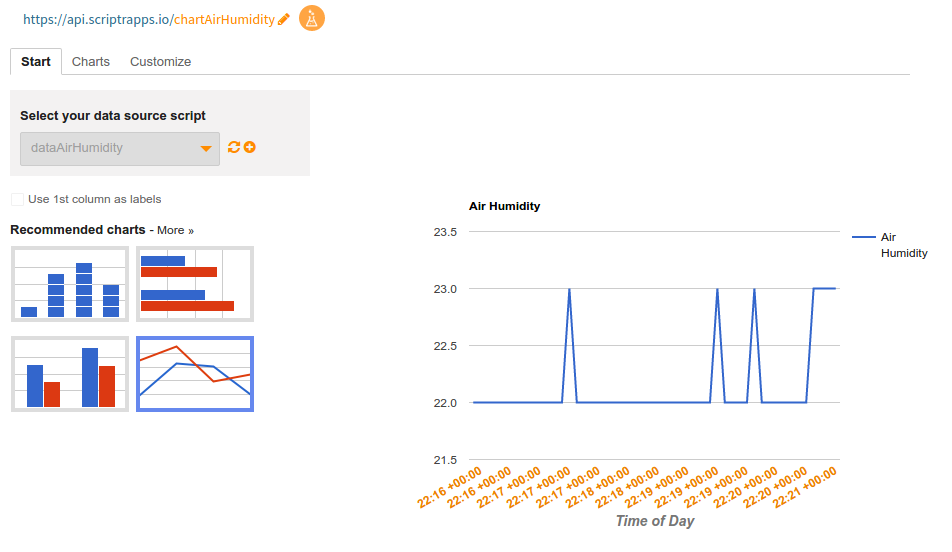

Smart Rain Gardens for Greener Cities
=====================================

Why Smart Rain Gardens
-----

Rain gardens are natural planted areas populated by native species whose topological design and species selection allows for enhanced water-attenuation efficiency. Rain gardens supplement our existing municipal water management capacity during and after water events through runoff and pollutant capture.  In addition, rain gardens also help replenish local aquifers and can also be quite beautiful, enhancing the built environment adjacent to the garden. Rain gardens provide a home for local species of plants and animals to thrive in an otherwise less hospitable built environment.

As our communities grow, the quantity of undeveloped land is dwindling, reducing the amount of open land available to passively absorb water during water events.  *Grassy areas are not enough.*  While somewhat porous, lawn areas are only 30% as effective in water-attenuation as a well-designed rain garden. Communities are looking for innovative and cost-effective ways to supplement overtaxed water management systems during water events (which have been increasing in frequency and severity in recent years). Rain gardens provide an excellent supplementary solution to help reduce the immediate need for costly municipal water management upgrades while also allowing for citizen engagement and ownership over their local community.

In the greater New York and New Jersey harbor area, we are particularly sensitive to water events from extreme weather and climactic change.  With each passing year, our capacity for water management and runoff capture is reduced by ongoing residential and commercial development.  Rain gardens implemented by private and municipal stakeholders can help satisfy requirements for an impactful, cost-effective, and aesthetically pleasing solution to help enhance our water management abilities.

Through the use of [monitoring nodes](https://github.com/things-nyc/boston-dec-2016-demo), we have access to real-time empirical data. By making datasets available ([here is an example of an open data portal](https://www.data.gov/)) to the general public, stakeholders may conduct analyses of water flow, and subsequently develop, recommend, and implement methodologies to effectively manage municipal runoff. [Utilizing connected devices/IoT](https://github.com/things-nyc/boston-dec-2016-demo) to monitor rain gardens, citizen-scientists can assist local government to help quantify rain-garden capacity and provide a compelling, empirical argument for inclusion into future civic planning, or even into future building code requirements.

Leveraging an affordable long-range radio wide area network [LoRaWAN radio technology](https://www.lora-alliance.org/What-Is-LoRa/LoRaWAN-White-Papers) in conjunction with [The Things Network](https://www.thethingsnetwork.org/) (TTN) to route data from a local monitoring node up to TTN backend, and then over to [Scriptr]( https://www.scriptr.io/) for data aggregation and visualization, local communities can immediately see and demonstrate how their rain gardens are providing a meaningful and lasting change in their communities.

Overview of Solution
-------

In this post, we present the results of a two-day hackathon with The Things Network New York to build IoT sensors for a smart rain garden. Combining hardware from MultiTech, mBed firmware, TTN backend, and Scriptr, we built a replicable proof-of-concept that could serve as the basis for future rain garden projects.

Hardware
-------

The first thing to consider when building an Internet of Things device is,
what exactly is being measured? For a rain garden,
we want to know the temperature and moisture of the growing soil,
the temperature of water leaving the drain spout and entering the garden,
as well as environmental conditions like light level, air temperature, and humidity.

To monitor these variables, we will need a suite of sensors.
We selected the following sensors:

 - [Ambient Light Sensor](https://www.adafruit.com/products/439)  (TSL2561)
 - [Soil Temperature and Moisture Sensor](https://www.adafruit.com/products/1298) (SHT10)
 - [Water Temperature Sensor](https://www.adafruit.com/products/381) (DS18B20)
 - [Air Temperature and Humidity Sensor](https://www.adafruit.com/products/385) (DHT22)
 

Next we need a microcontroller to read from the sensors, and a radio to send sensor data up to the internet.
There are many options here. We settled on mDot from MultiTech because it combines a microcontroller and radio into an easy-to-use yet powerful package:

 - [MultiTech mDot](http://www.multitech.com/models/94557148LF) (MTDOT-915-X1P-SMA-1)
 - [mDot Developer Kit](http://www.multitech.com/models/94558010LF) (MTUDK2-ST-MDOT)

Lastly, we need just a few miscellaneous components:

 - Thin hookup wire (30AWG "wirewrap" wire works great)
 - 2x 4.7kOhm thru-hole resistors

And a few tools:

 - Soldering Tools (iron, solder, flux, needle-nose pliers)
 - Safety glasses
 - An area with good ventilation to solder your components
 - Notebook for notes while wiring
 - Laptop for firmware development and debugging
 - Desk vise like [Panavise](http://www.panavise.com/) for holding circuit boards
 - Oscilloscope (optional) for hardware debugging

Assembly is as simple as soldering the various sensors onto the Proto Shield,
using the pull-up resistors as described in the Adafruit product pages for each of the sensors,
and connecting the data lines to the Arduino headers on the MultiTech development board as follows:

 - D6 (PA1) = DHT22 data pin
 - D7 (PA11) = DS18B20 data pin
 - D10 (PA4) = SHT10 data pin
 - D2 (PC13) = SHT10 clock pin
 - D14 (PC9) = TSL2561 data (SDA) pin
 - D15 (PA8) = TSL2561 clock (SCL) pin
 
We also used some 100-mil female sockets (which come with the Proto Shield) to make connectors for the Water and Soil sensors. This way they can be inserted/removed easily. The result looks like this:

Firmware
-------

With the node constructed, it's time to write firmware to breathe life into the device!

We used the [ARM mBed](https://developer.mbed.org/) platform for wiring firmware. While traditional development environments (IDEs like Arduino, IAR, Keil) require a software installation, mBed works entirely in your web browser, making it easy to get started.

On mBed, the first step is to find an example application for using the mDot. We started with a [project](https://developer.mbed.org/users/merckeng/code/mDot_TTN_DHT11/) that demonstrated using the mDot to read a DHT11 sensor and send data to The Things Network. However, we still need to teach the mDot to read from the sensors we have selected. For this, we need *libraries*.

By using the mBed compiler's "import" tool, we found a library for each of our sensors:

 - [DHT22 Library by Julepalme](http://mbed.org/users/Julepalme/code/DHT22/)
 - [DS18B20 Library from Richard Lane](https://developer.mbed.org/users/richardlane/code/DS18B20_1wire/)
 - [SHTx Library courtesy of Ron of NegativeBlack](https://developer.mbed.org/users/richardlane/code/DS18B20_1wire/)
 - [TSL2561_I2C Library by Karl Maxwell](https://developer.mbed.org/users/karlmaxwell67/code/TSL2561_I2C/)

We imported each of the libraries into our mBed project, and added code to use the libraries, initialize the sensors, read data, and prepare the data for sending to The Things Network. To get started right away, you can [click here](https://developer.mbed.org/users/merckeng/code/mDot_TTN_DHT11_Boston16_CAM/) to fork the project repository on mBed. Note that this code reads from all sensors and sends a packet of data every 5 seconds. *This is for testing and demonstration purposes only!* In a real application, you will only want to send about one packet per hour to conserve spectrum for other users.

Putting the code onto the mDot is incredibly easy with mBed: Just plug the development board into your laptop using the USB cable. A storage 'drive' will appear, that looks on your PC like a USB flash drive. You then click "compile" in mBed, a '.bin' file downloads to your computer, and you simply drag-and-drop it from the downloads folder into the 'drive'. You will see flashing lights on the development board, and soon it will start running your program.

You can get a view into what is going on inside the mDot by opening a serial terminal program on your PC (like RealTerm or TeraTerm on Windows, or "screen" on OSX and Linux):

    screen /dev/ttyACM0 115200

The Things Network
-----------------

Now that the hardware is transmitting data, we need to register our device with an Application on The Things Network.

We assume that you have The Things Network coverage already. If you live far away from civilization, you may need to [setup your own gateway](https://www.google.com/webhp?sourceid=chrome-instant&ion=1&espv=2&ie=UTF-8#safe=active&q=how+to+setup+the+things+network+gateway+).

To setup our application, we go to [The Things Network dashboard](https://account.thethingsnetwork.org/). You create an account, and then follow a few steps:

 - Click on "Create an Application" and follow the on-screen instructions.
 - Copy the App EUI. This number uniquely identifies your application.

 - Next click on "Register a Device"
 - Select ABP (Activation by Personalization)
 - Click "Register"

 - Copy the Dev Address, App Session Key, and Network Session Keys in the "msb" format.
 - Click "Relax Frame Count" (this is OK to do for development nodes, but *not* in production).

Now that you have copied Dev Address, App Session Key, and Network Session Key, go back to mBed and add these strings to the main.cpp file. This will uniquely identify your node on TTN and provide encryption over-the-air (and over-the-Internet). Recompile and download to your node.

Now you should see packets arriving in the "Messages" window of the TTN dashboard.
But these packets are in binary, and difficult for humans (and JavaScript) to deal with.
So we will click on "edit" next to Payload Functions in the Application page of the TTN dashboard,
and paste the following code:

	function (bytes) {
	 // Decoder
	 // Here can decode the payload into json.
	 // bytes is of type Buffer.
	 retval = {payload: bytes};
	 retval['packet_type'] = bytes[0];
	 /* check for packet type in first byte */
	 if (bytes[0] != 0x11) {
	   retval['error'] = "Unknown packet type.";
	   return retval;
	 }
	 // for now, we assume all sensors present.
	 int16_to_float = function(b0,b1) {
	   // convert from two's compliment
	   if (b0 >= 128) {
	     b0 -= 256;
	   }
	   return 256*b0+b1;
	 };
	 uint16_to_float = function(b0,b1) {
	   // convert from two's compliment
	   return 256*b0+b1;
	 };
	 retval['vbat'] = int16_to_float(bytes[2],bytes[3])/4096;
	 retval['air_temperature'] = int16_to_float(bytes[4],bytes[5])/256;
	 retval['air_pressure'] = uint16_to_float(bytes[6],bytes[7])*4;
	 retval['air_humidity'] = bytes[8]*0.390625;
	 retval['ambient_light'] = uint16_to_float(bytes[9],bytes[10]);
	 retval['water_temperature'] = int16_to_float(bytes[11],bytes[12])/256;
	 retval['soil_temperature'] = int16_to_float(bytes[13],bytes[14])/256;
	 retval['soil_humidity'] = bytes[15]*0.390625;
	 return retval;
	}

Now packets will be decoded into human-readable fields in the Messages panel (and in MQTT):

Scriptr
-------

Now that we have data flowing from our rain garden sensors,
we need to patch the MQTT stream provided by TTN into Scriptr's REST interface.
We do this using [an mqtt2rest bridge](https://github.com/things-nyc/boston-dec-2016-demo/tree/master/nodejs).
Spin this up either on your laptop or on an internet virtual machine,
following the instructions in the [repository](https://github.com/things-nyc/boston-dec-2016-demo/tree/master/nodejs) for inserting your TTN and Scriptr credentials.

Next we add the rain garden visualization code to the Scriptr account. You can pull a copy from our [github repository](https://github.com/things-nyc/boston-dec-2016-demo/tree/master/scriptr). The `saveRaingarden.js` script receives packets from TTN, while the `data*.js` scripts visualize the data in the form of graphs.

You can view our datastream by visiting (URL).

What's Next?
----

[Try Scriptr](https://www.scriptr.io/)

[Check out the latest hardware from MultiTech](http://www.multitech.com/)

[Follow The Things Network NYC on Twitter](https://twitter.com/thethingsnyc)

Rain garden images are from the Wisconsin Dept. of Natural Resources publication PUB-WT-776 2003, used with permission.
